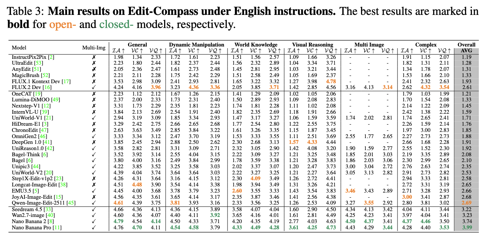
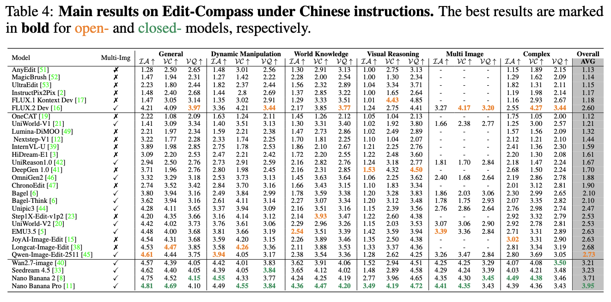
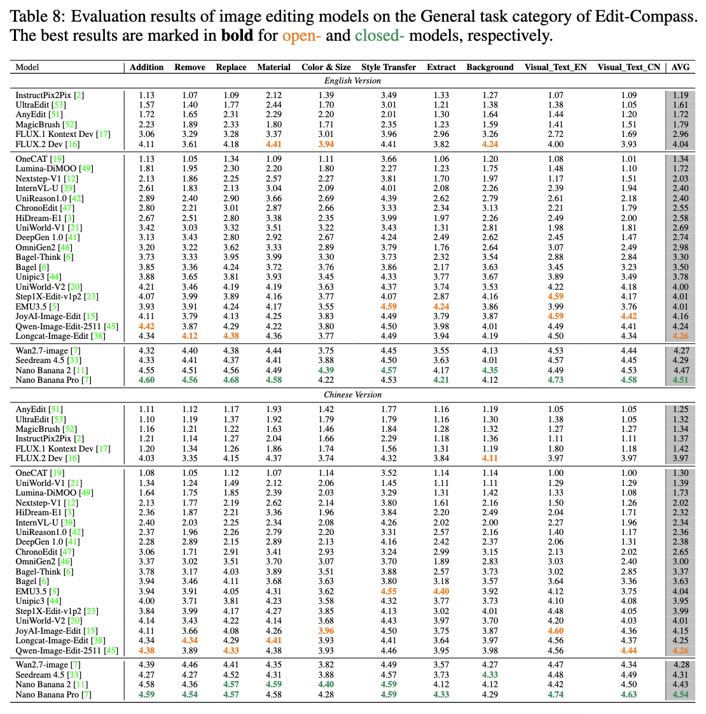
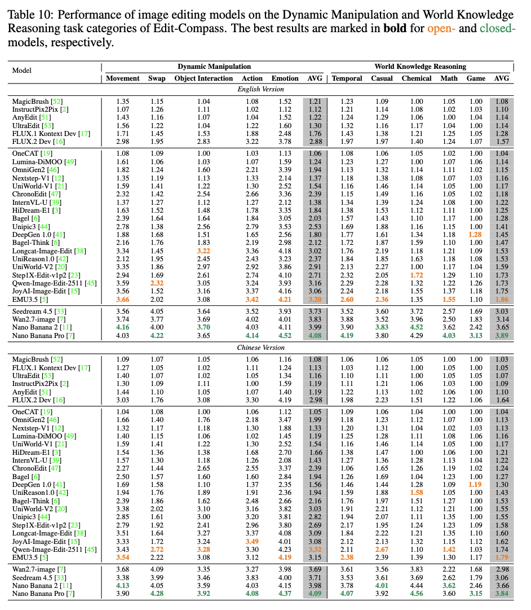
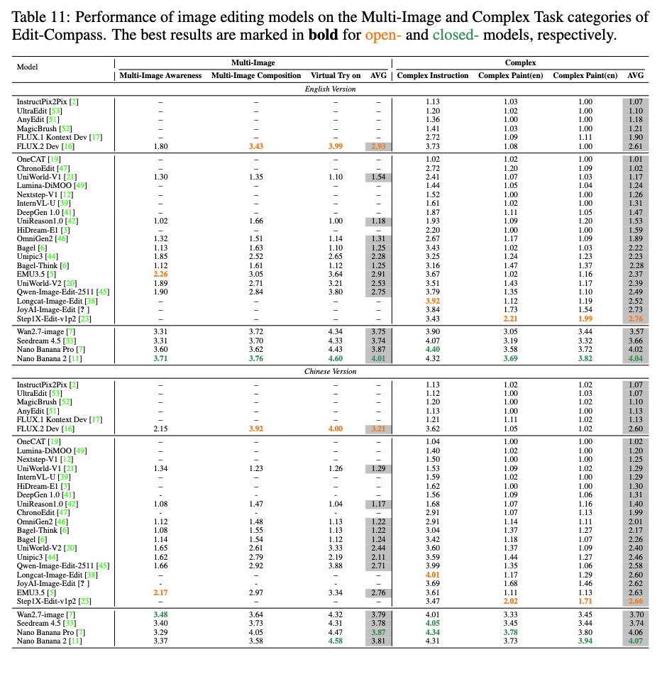
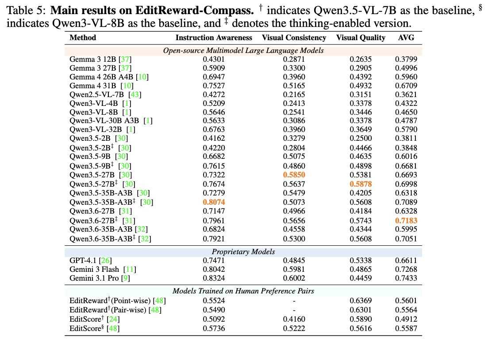

<h1 align="center">
Edit-Compass & EditReward-Compass: A Unified Benchmark for Image Editing and Reward Modeling
</h1>

<p align="center">
  <strong>Xuehai Bai</strong><sup>1*</sup>,
  <strong>Yang Shi</strong><sup>2,3*</sup>,
  <strong>Yi-Fan Zhang</strong><sup>4*†</sup>,
  <strong>Xuanyu Zhu</strong><sup>2</sup>,
  <strong>Yuran Wang</strong><sup>2</sup>
  <br>
  <strong>Yifan Dai</strong><sup>3</sup>,
  <strong>Xinyu Liu</strong><sup>3</sup>,
  <strong>Yiyan Ji</strong><sup>3</sup>,
  <strong>Xiaoling Gu</strong><sup>1‡</sup>,
  <strong>Yuanxing Zhang</strong><sup>3‡</sup>
</p>

<p align="center">
  <sup>1</sup>HDU &nbsp;&nbsp;
  <sup>2</sup>PKU &nbsp;&nbsp;
  <sup>3</sup>Kling Team &nbsp;&nbsp;
  <sup>4</sup>CASIA
</p>

<p align="center">
  <sup>*</sup>Equal contribution &nbsp;&nbsp;
  <sup>†</sup>Project lead &nbsp;&nbsp;
  <sup>‡</sup>Corresponding author
</p>

<p align="center">
  <a href="#">📄 Paper</a> |
  <a href="https://huggingface.co/datasets/DogNeverSleep/Edit-Compass">🤗 Edit-Compass Dataset</a> |
  <a href="https://huggingface.co/datasets/DogNeverSleep/EditReward-Compass">🤗 EditReward-Compass Dataset</a>
</p>

Recent image editing models have made rapid progress in instruction following, multimodal understanding, and complex visual editing. However, many existing benchmarks are no longer sufficient for evaluating strong frontier systems: their tasks are often too simple, their scoring protocols are too coarse, and their results may diverge from human judgment. At the same time, reward models are becoming central to reinforcement learning based image editing, but reward-model benchmarks often use settings that do not reflect practical RL optimization.

- **Edit-Compass** evaluates image editing models on 2,388 carefully annotated instances across six progressively challenging task categories, covering world knowledge reasoning, visual reasoning, dynamic manipulation, multi-image editing, and other editing capabilities. It uses fine-grained multidimensional evaluation with structured reasoning and scoring rubrics.
- **EditReward-Compass** evaluates reward models with 2,251 preference pairs designed to simulate realistic reward modeling scenarios during RL-based image editing optimization.

We further conduct extensive evaluations on **29 frontier image editing models** and **21 reward models**, covering both proprietary and open-source systems. The results expose persistent weaknesses in world knowledge understanding, visual reasoning, and multi-image editing, while showing that native multimodal large language models can serve as strong reward evaluators.

<a id="news"></a>

## 🔥 News

- `2026/05` 🌟 We have released the evaluation code and scripts for Edit-Compass and EditReward-Compass.
- `2026/05` 🌟 We have released the Edit-Compass and EditReward-Compass datasets on Hugging Face.

<a id="benchmark-overview"></a>

## 📌 Benchmark Overview

| Benchmark | Target | Size |
| :---: | :---: | :---: |
| **Edit-Compass** | Image editing model evaluation | 2,388 |
| **EditReward-Compass** | Reward model evaluation | 2,251 |

We evaluate **29 frontier image editing models** with Edit-Compass and **21 reward models** with EditReward-Compass.

<a id="results"></a>

## 🏅 Model Rankings

<details>
<summary><strong>Edit-Compass overall performance on English evaluation</strong></summary>

<p align="center">
  
</p>
</details>

<details>
<summary><strong>Edit-Compass overall performance on Chinese evaluation</strong></summary>

<p align="center">
  
</p>
</details>

<details>
<summary><strong>Edit-Compass performance on General Task</strong></summary>

<p align="center">
  
</p>
</details>

<details>
<summary><strong>Edit-Compass performance on Dynamic Manipulation and World Knowledge Reasoning tasks performance</strong></summary>

<p align="center">
  
</p>
</details>

<details>
<summary><strong>Edit-Compass performance on Multi-Image and Complex Tasks </strong></summary>

<p align="center">
  
</p>
</details>

<details>
<summary><strong>EditReward-Compass reward model ranking</strong></summary>

<p align="center">
  
</p>
</details>

## 📚 Contents

- [🔥 News](#news)
- [📌 Benchmark Overview](#benchmark-overview)
- [🏅 Model Rankings](#results)
- [🧭 Edit-Compass](#Edit-Compass)
- [📊 EditReward-Compass](#editreward-compass)
- [🧩 Dataset Expectations](#dataset-expectations)


<a id="Edit-Compass"></a>

## 🧭 Edit-Compass

<a id="Edit-Compass-quick-start"></a>

### 🚀 Quick Start

**1. Generate edited images**

First, update the `ModelWrapper` in `Edit-Compass/gen_image.py` so that it correctly loads your image editing model and runs inference. Then update the paths, model settings, language, and GPU configuration in `Edit-Compass/scripts/gen_image.sh`.

Key generation arguments:

| Argument | Description |
| --- | --- |
| `data_root` | Root directory of the source images and input task JSON files. |
| `save_root` | Directory where generated images and result JSON files will be saved. |
| `language` | Evaluation language, such as `en` or `cn`. |
| `model_path` | Path to the image editing model checkpoint. |
| `gpu_ids` | GPU IDs used for image generation. |
| `support_multi_image` | Enable this flag for multi-image tasks. |

```bash
bash Edit-Compass/scripts/gen_image.sh
```


**2. Evaluate generated results**

Configure the evaluation settings in `Edit-Compass/scripts/eval.sh`, including the dataset path, generated image path, language, evaluation metrics, API key, and API base URL. Then run:

```bash
bash Edit-Compass/scripts/eval.sh
```


**3. Summarize scores**

Configure `Edit-Compass/scripts/summary.sh` to select the dataset root, result directory, task parts, and languages to summarize.

| Argument | Description |
| --- | --- |
| `source_dir` | Root directory of the benchmark JSON files. |
| `save_dir` | Directory containing generated and evaluated results. |
| `summary_Part` | Task parts to summarize, such as `Part1 Part2 Part3`. |
| `support_language` | Language versions to summarize, such as `en cn`. |

Then run:

```bash
bash Edit-Compass/scripts/summary.sh
```


<a id="editreward-compass"></a>

## 📊 EditReward-Compass

```bash
python EditReward-Compass/eval.py \
  --source_json /path/to/reward_eval.json \
  --output_json /path/to/reward_results.json \
  --model_path Qwen/Qwen3-VL-8B-Instruct \
  --dim IA VC VQ
```


<a id="dataset-expectations"></a>

## 🧩 Dataset Expectations

The dataset root should follow the task layout defined in:

```text
Edit-Compass/config.py
```

For example:

```text
Edit-Compass/
├── Part1/  General Tasks
│   ├── ADD/ADD.json
│   ├── Remove/Remove.json
│   └── ...
├── Part2/  Dynamic Manipulation Tasks
├── Part3/  World Knowledge Reasoning Tasks
├── Part4/  Algorithm Visual Reasoning Tasks
├── Part5/  Multi-Image Tasks
└── Part6/  Complex Tasks
```
